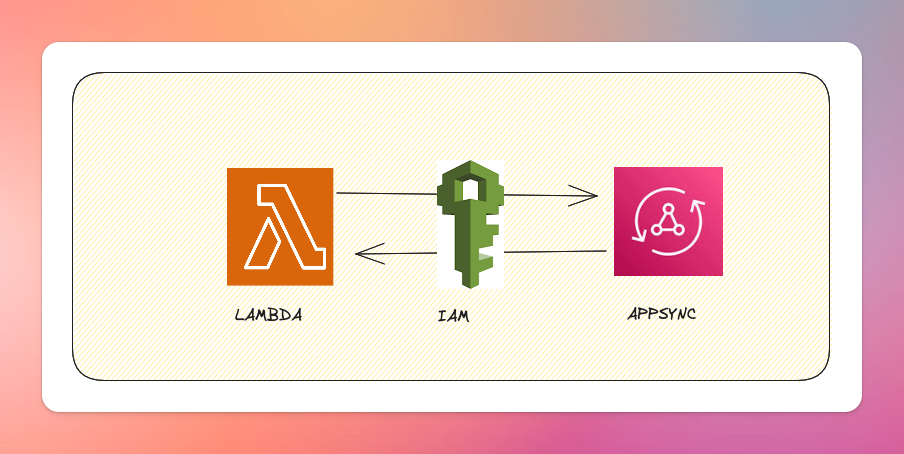

# CallAppsyncAPI

Package to call APPSYNCAPI using IAM

Simple function to aws appsync api inside aws lambda,PS: Lambda should have approriate IAM role to call the Appsync API



Example usage:

`import callAppSyncAPI from "callappsyncapi"`

`const response = await callAppSyncAPI(APIURL, apiRegion, mutation, "notifyLiked", variables);`

Detail Example

```typescript
const APIURL = "";
const apiRegion = "";

export const handler = async (event: any) => {
  for (const record of event.Records) {
    if (record.eventName === "INSERT") {
      const like: any = DynamoDB.Converter.unmarshall(record.dynamodb.NewImage);
      await notifyLiked(like);
    }
  }
};

async function notifyLiked(like: any) {
  try {
    let tweet = await getTweetById(like.tweetId);
    tweet = DynamoDB.Converter.unmarshall(
      tweet as Record<string, AttributeValue>
    );

    console.log("TWEET", tweet);
    console.log("LIKE", like);
    if (!tweet) {
      throw new Error(`Tweet with id ${like.tweetId} not found`);
    }
    const mutation = print(graphql`
      mutation notifyLiked(
        $id: ID!
        $userId: ID!
        $tweetId: ID!
        $likedBy: ID!
      ) {
        notifyLiked(
          id: $id
          userId: $userId
          tweetId: $tweetId
          likedBy: $likedBy
        ) {
          __typename
          ... on Liked {
            id
            type
            userId
            tweetId
            likedBy
            createdAt
          }
        }
      }
    `);

    const id = ulid();
    const variables = {
      id: id,
      userId: tweet.creator,
      tweetId: tweet.id,
      likedBy: like.userId,
    };

    // calling our appsync function
    const response = await callAppSyncAPI(
      APIURL,
      apiRegion,
      mutation,
      "notifyLiked",
      variables
    );

    console.log("Notification response:", response);
  } catch (error) {
    console.error("Error while notifying like:", error);
  }
}
```
